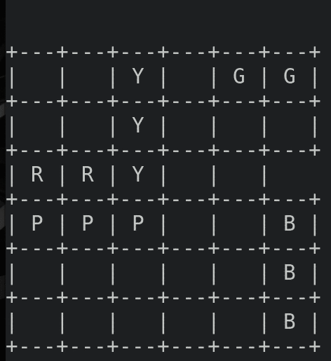
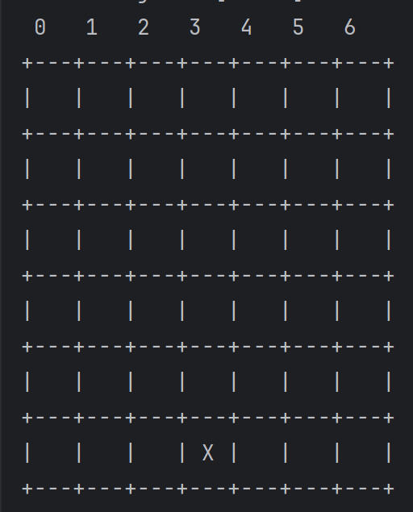

# SAE_IA_2023

PERROT Alexandre - BAUBY Gaspard - PINCHON Théo

La SAE se compose de 2 parties distinctes.

* ### MLP (Multi Layers Perceptron)

La première phase concerne la mise en place un perceptron multi-couches, dit MLP.
Dans la continuité du cours, nous avons tout d'abord implémenté une version simplifiée du MLP capable d'apprendre des tables logiques telles que le ET, OU ou encore le XOR.
Alors que les deux premières ne nécessitent qu'un seul perceptron, le XOR quand à lui à besoin de 2 neurones au minimum dans sa couche cachée.

Une fois la phase d'approche terminée, nous avons complexifié la tâche en modifiant le MLP afin qu'il accepte des entrées autres que binaires, comme par exemple les images de MNIST.
Pour ce faire, le nombre d'entrées correspond au nombre de pixels présent dans chaque image. A la sortie, nous avons 10 possibilités correspondant chacune à un chiffre compris entre 0 et 9 inclus.
Avec ces changements, on peut remarquer que des couches cachées allant de 15 à 10 neurones deviennent insuffisantes. Le choix de ce nombre étant arbitraire, nous avons choisis de prendre 2 couches cachées avec respectivement 150 et 100 neurones.
Obtenant maintenant des resultats concluants, nous avons pus confronté notre algorithme de classification par réseau de neurones (MLP) à l'algorithme de classification par les plus proches voisins (KNN).

 La conslusion est des plus mitigées puissent MLP se trouve être plus long à entrainer mais plus précis dans ses réponses, c'est à dire une marge d'erreur plus faible : 2% d'erreurs. KNN, quand à lui, ne nécessite pas d'entrainement puisqu'il intérroge sa banque de données à chaque nouvelle requête. Néanmoins, il est moins précis (3% d'erreurs) et se trouve dépacé par la réponse presque instantanée d'un MLP entrainé alors que lui, continue à parcourir la totalité de ses données avant de répondre.
Pour une utilisation discrète, KNN est donc favorisée, là ou MLP reste de loin le plus efficace sur une utilisation récurrente et complexe.

* ### Défis

  La deuxième phase de la SAE porte sur le choix de 2 défis parmis les 3 suivants : 
  * Recherche d'itinéraire GPS
  * Modélisation du problème RushHour
  * Application de l'algorithme Alpha-Beta sur le puissance 4

  #### Défi 2: Modélisation du problème RushHour
  
  Qu'est ce que _RushHour_ ? Dans notre contexte, nous pouvons le définir comme étant un problème de recherche dans lequel le but est de faire sortir une voiture rouge coincée au fond d'un parking.
  Il va donc falloir circuler les voitures les unes après les autres afin de laisser place à la voiture en question pour qu'elle puisse sortir.

  Pour modéliser ce jeu, la première étape concerne la représentation d'un état du jeu par une liste de véhicules. Un véhicule pouvant être un camion ou une voiture, il doit donc décrire sa taille de 2 ou 3 cases. Sa position ainsi que sa direction verticale ou horizontale sont également requises. A partir de ces informations, nous pouvons donc établir la liste des actions puisque chaque véhicule peut soit avancer soit reculer. Au total, le jeu comporte un maximum de 12 voitures et 4 camions soit 32 actions. Bien évidemment, toutes les actions ne sont pas possibles au court d'une partie puisque les véhicules peuvent être bloqués ou absents du plateau.
  
  Grace aux informations précédentes, il n'est pas obligatoire de définir l'ensemble des transitions puisque chacune d'elles sera calculée en fonction d'une action donnée appliquée à un état initiale. De plus le coût de chaque transition est de 1.0 déplacement puisque l'on cherche à minimiser le nombre déplacement nécessaire pour faire sortir la voiture rouge. En regroupant les données, on peut maintenant définir efficacement le problème sous la forme { State, Action, Transition, Cost }. Cette modélisation nécessite également la condition d'arrêt représentée par l'état But à atteindre.
  

  #### Défi 3: Application de l'algorithme Alpha-Beta sur le puissance 4

  Avant de commencer à décrire l'utilisation de l'algorithme Alpha-Beta, il est préférable d'en exprimer l'origine. L'algorithme en question est basé sur son prédécésseur appelé MinMax, qui lui même est basé sur le principe d'évaluation d'un jeu. Pour ce faire, le premier joueur devra maximiser le score de la partie en jouant des coups qui lui sont avantageux. Le second devra, de la même façon, diminuer ce score. C'est ainsi que fonctionne MinMax. Le principal inconvénient est que sur des jeux aux coups multiples, pour savoir si un coup est avantageux, il faut calculer tous les coups possibles à l'avance ce qui donne une quantité monstrueuse de calcul à effectuer. Dans un premier temps, l'idée est de limiter l'algorithme à une profondeur maximale de calcul. Par exemple, on peut limiter MinMax au calcul des 6 prochains pour savoir lequel est le plus avantageux. Néanmoins, dans le jeu du puissance 4 comportant 7 colonnes, une profondeur de 6 laisse place à 7⁶ = 117 649 calculs d'états. Cette solution n'étant pas suffisante, c'est à ce moment là qu'Alpha-Beta devient intéressant.
  
  Cet algorithme reprend chaque principe définit précédemment en y ajoutant l'idée que si un coup stupide est trouvé alors on ne le développe pas. Bien évidemment, un programme est incapable de comprendre l'idée de stupidité. C'est pourquoi un coup évalué comme tel correspond à l'action qui diminue le score de la partie alors que le but du joueur qui l'effectue est d'augmenter ce score. Cette méthode permet alors de diviser jusqu'à deux fois le nombre d'états calculé et rend ainsi le jeu plus rapide et efficace.

  
